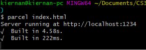
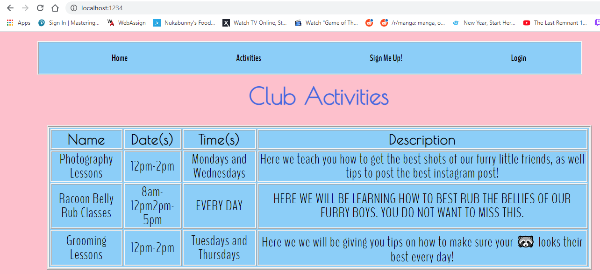

**Student Name**:  Kiernan Soriano

**NetID**: ue5795

# Homework #11 Solutions
## Question 1
### (a) Add Template and Path for "members" info

### (b) Protect "member" info with Middleware
```javascript
// Use this middleware to restrict paths to only admins
const checkAdminMiddleware = function (req, res, next) {
	console.log(`CURRENT ROLE: ${req.session.user.role}`);
    if (!(req.session.user.role === 'admin')) {
        res.render("Forbidden.njk");
	} 
    else {
		next();
	}
};
```
#### Below is a screenshot of the page for unauthorized users:


## Question 2
### (a) Protect Add Activity Interface
#### One way to test this protection would be to get in an account that is not an admin and call the addActivity page through the address bar and manually add in queries. Ex: /addActivity?name=this&dates=is&times=a&description=test2


### (b) Deploy Server
[My Server](http://drbsclasses.org/student30/node/)

## Question 3
### (a) Create package.json
#### I created the package.json file by running npm init --yes in gitbash while in the clubReact directory.

### (b) Global Install of Parcel, Local Install of React
#### Below is the contents of my package.json
```json
{
  "name": "clubReact",
  "version": "1.0.0",
  "description": "",
  "main": "index.js",
  "scripts": {
    "test": "echo \"Error: no test specified\" && exit 1"
  },
  "keywords": [],
  "author": "",
  "license": "ISC",
  "dependencies": {
    "react": "^17.0.2",
    "react-dom": "^17.0.2"
  }
}
```
### (c) Create a basic HTML file
### (d) Write your first React App
### (e) Run Parcel.js in development mode



## Question 4
### (a) Starter React with CSS
### (b) Menu Component
#### The filename of my menu component is menu.js
#### Below you will see the screenshot of my app with my imported menu:

### (c) Home Component
#### The filename of my menu component is home.js
#### Below you will see the screenshot of my app with my imported menu and home:


## Question 5
### (a) Activities Component
#### The filename of my menu component is activities.js
#### Below you will see the screenshot of my app with my imported menu and activity page:

### (b) Membership Component
#### The filename of my menu component is membership.js
#### Below you will see the screenshot of my app with my imported menu and membership page:

